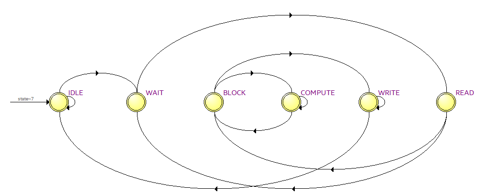
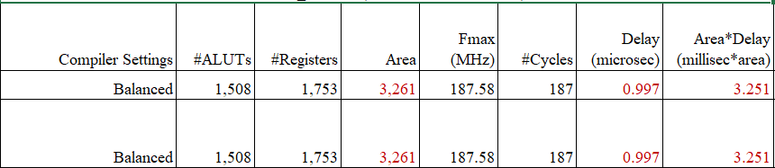
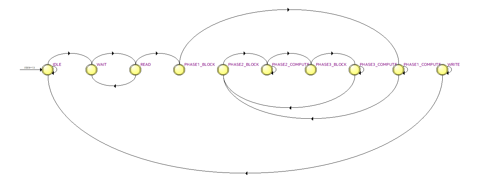
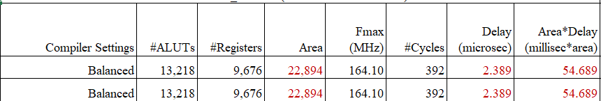

# Sha256-Bitcoin-Hash

## Table of Contents
- [Part 1: Simplified SHA-256 Core](#part-1-simplified-sha-256-core)
  - [Overview](#overview)
  - [States](#states)
  - [State Diagram](#state-diagram)
  - [Performance](#performance)
  - [Transcript Output](#transcript-output)
- [Part 2: Bitcoin Hash (Bitcoin Miner)](#part-2-bitcoin-hashbitcoin-miner)
  - [Overview](#overview-1)
  - [States](#states-1)
  - [State Diagram](#state-diagram-1)
  - [Performance](#performance-1)
  - [Transcript Output](#transcript-output-1)


## Part 1: Simplified SHA-256 Core
### Overview
A simplified SHA-256 hardware core that hashes a fixed 20-word (640-bit) message stored in memory and writes the 256-bit digest (8 words) back to memory. A finite-state machine (FSM) sequences memory reads, block setup (including padding), the 64 compression rounds per block, and the final write-back.

### States
* IDLE – Initialization / waiting
* WAIT – One-cycle delay
* READ – Load message words
* BLOCK – Prepare 512-bit block
* COMPUTE – Perform 64 rounds
* WRITE – Output digest

### State Diagram


### Performance


### Transcript Output
```
# --------
# MESSAGE:
# --------
# 01234567
# 02468ace
# 048d159c
# 091a2b38
# 12345670
# 2468ace0
# 48d159c0
# 91a2b380
# 23456701
# 468ace02
# 8d159c04
# 1a2b3809
# 34567012
# 68ace024
# d159c048
# a2b38091
# 45670123
# 8ace0246
# 159c048d
# 00000000
# ***************************
# 
# ---------------------
# COMPARE HASH RESULTS:
# ---------------------
# Correct H[0] = bdd2fbd9	Your H[0] = bdd2fbd9
# Correct H[1] = 42623974	Your H[1] = 42623974
# Correct H[2] = bf129635	Your H[2] = bf129635
# Correct H[3] = 937c5107	Your H[3] = 937c5107
# Correct H[4] = f09b6e9e	Your H[4] = f09b6e9e
# Correct H[5] = 708eb28b	Your H[5] = 708eb28b
# Correct H[6] = 0318d121	Your H[6] = 0318d121
# Correct H[7] = 85eca921	Your H[7] = 85eca921
# ***************************
# 
# CONGRATULATIONS! All your hash results are correct!
# 
# Total number of cycles:         187
# 
# 
# ***************************
```


## Part 2: Bitcoin Hash(Bitcoin Miner)
### Overview
This module implements Bitcoin double-SHA256 hashing on a 20-word block header while varying the nonce. It first hashes the header’s first 16 words once (Phase 1), then processes the second block with the nonce and padding in parallel for 8 nonces at a time (Phase 2). Each Phase 2 result is then re-hashed (Phase 3) to complete the Bitcoin double hash. Finally, the design writes out 16 results (H0[0]…H0[15])—one per nonce—to memory before signaling.

### States
* IDLE – Waits for start; initializes hash constants, working registers, and control signals.
* WAIT – Inserts a one-cycle delay (e.g., for memory read latency).
* READ – Reads all 20 input words (19 header words + 1 nonce slot) from memory into message[].
* PHASE1_BLOCK – Prepares the first 512-bit block (message[0..15]) with no nonce; seeds working registers with SHA-256 constants.
* PHASE1_COMPUTE – Runs 64 SHA-256 rounds on the first block; stores intermediate digest for later use.
* PHASE2_BLOCK – Builds the second 512-bit block with header words [16..18], the nonce, padding, and message length (640 bits); initializes registers with Phase 1 output.
* PHASE2_COMPUTE – Executes 64 rounds in parallel across multiple nonces; updates hash state for each nonce.
* PHASE3_BLOCK – Constructs the input block for the second SHA-256 pass using Phase 2 results (H0..H7), padding, and 256-bit length; resets working registers to SHA-256 constants.
* PHASE3_COMPUTE – Runs 64 rounds per nonce to complete the double SHA-256; stores final results into h0_out[].
* WRITE – Sequentially writes out the 16 computed results (one per nonce) to memory at output_addr; returns to IDLE when finished.

### State Diagram


### Performance


### Transcript Output
```
# ---------------
# 19 WORD HEADER:
# ---------------
# 01234567
# 02468ace
# 048d159c
# 091a2b38
# 12345670
# 2468ace0
# 48d159c0
# 91a2b380
# 23456701
# 468ace02
# 8d159c04
# 1a2b3809
# 34567012
# 68ace024
# d159c048
# a2b38091
# 45670123
# 8ace0246
# 159c048d
# ***************************
# 
# ---------------------
# COMPARE HASH RESULTS:
# ---------------------
# Correct H0[ 0] = 7106973a	Your H0[ 0] = 7106973a
# Correct H0[ 1] = 6e66eea7	Your H0[ 1] = 6e66eea7
# Correct H0[ 2] = fbef64dc	Your H0[ 2] = fbef64dc
# Correct H0[ 3] = 0888a18c	Your H0[ 3] = 0888a18c
# Correct H0[ 4] = 9642d5aa	Your H0[ 4] = 9642d5aa
# Correct H0[ 5] = 2ab6af8b	Your H0[ 5] = 2ab6af8b
# Correct H0[ 6] = 24259d8c	Your H0[ 6] = 24259d8c
# Correct H0[ 7] = ffb9bcd9	Your H0[ 7] = ffb9bcd9
# Correct H0[ 8] = 642138c9	Your H0[ 8] = 642138c9
# Correct H0[ 9] = 054cafc7	Your H0[ 9] = 054cafc7
# Correct H0[10] = 78251a17	Your H0[10] = 78251a17
# Correct H0[11] = af8c8f22	Your H0[11] = af8c8f22
# Correct H0[12] = d7a79ef8	Your H0[12] = d7a79ef8
# Correct H0[13] = c7d10c84	Your H0[13] = c7d10c84
# Correct H0[14] = 9537acfd	Your H0[14] = 9537acfd
# Correct H0[15] = c1e4c72b	Your H0[15] = c1e4c72b
# ***************************
# 
# CONGRATULATIONS! All your hash results are correct!
# 
# Total number of cycles:         392
# 
# 
# ***************************
```

